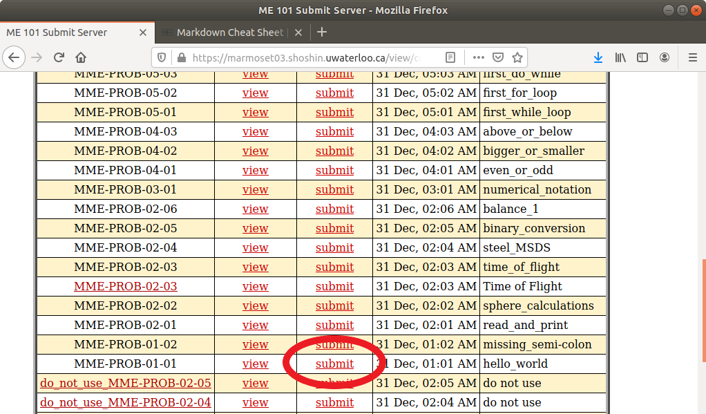

Problem Number: MME-PROB-01-01
------------------------------

Problem Title: Using Marmoset to Learn Coding C++
=================================================

Doing this set of Marmoset problems will help you learn how to code and solve problems through coding. In this first problem, you will be introduced to the Marmoset system and will make your first submission.

The main steps in this first problem will be:
* Create a C++ program to output "Hello World!" to the console.
* Name the file hello_world.cpp.
* Submit your code to the Marmoset code testing server for evaluation and feedback.

## CREATING CODE FILE

It does not matter which editor you use in order to create your code. Some common options include:

* Atom text editor along with command-line compilation
* Code::Blocks
* Eclipse IDE along with Cygwin

Using your editor, create your Hello World program. Here is a sample C++ Hello World program you can use for this problem.

```
#include <iostream>

using namespace std;

int main()
{
  cout << "Hello World!" << endl;
  return 0;
}
```

## LOCAL TESTING

It is usually a good idea to test your code on your own computer before submitting it to Marmoset. Marmoset uses the g++ compiler, so it is recommended you use this compiler on your computer as well.

Compile and run your code on your own- computer to see if you get the expected results.

## FILE NAMING

Marmoset requires a specific file name for each project you submit to. For this first project, the file name must be hello_world.cpp. The filename is case-sensitive.

## ACCESSING MARMOSET

To access the Marmoset system, point your web browser to https://marmoset03.shoshin.uwaterloo.ca. You will be required to sign in with your usual University of Waterloo credentials.

Once logged in, you should see a page showing the available projects for the course.


## SUBMITTING CODE

From the table of projects, click the 'submit' link for the desired project. For this project, the project number is MME-PROB-01-01 and the project title is hello_world.



Click the 'Choose File' button and then select your hello_world.cpp file. Click the 'Submit project!' button.

## CHECKING RESULTS

Upon successful submission of your code, you will find your submission listed on the Submissions table. Your submission is put on the queue for the Marmoset server to test your code. It usually takes about 2 minutes for a small problem to be tested, and up to 10 minutes for a large problem to be tested.

When the submission is waiting in the test queue, it will show on the Submissions table as 'not tested yet'. Once it has been tested, the Submissions table will show a summary of the test results.


By clicking on the provided link for detailed test results, you will be shown a page with more detailed information about each specific test that was run on your code.


## FURTHER ASSISTANCE

If you made a submission but don't seem to be getting the proper results, email David Lau at d24lau@uwaterloo.ca for further assistance.
