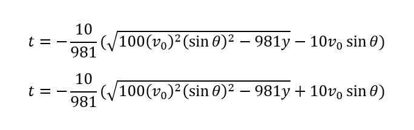

Problem Number: MME-PROB-02-03
------------------------------

Problem Title: Time of Flight
=============================

Code filename: time_of_flight.cpp

David is using a trebuchet to launch pumpkins from a platform. He would like your assistance calculating the time of flight for the pumpkin. He will ignore the effects of air resistance for this problem.

The time of flight can be calculated using the two following equations. There are two equations because the solving for the time is a quadratic system, with two possible mathematical solutions. Your program should give both possible solutions.

Where
* t : time of flight
* v0 : initial velocity
* theta : launch angle
* y : change in elevation

You will require the < cmath > library in order to use the sqrt(), pow(), and sin() functions as well as the M_PI constant. Use the following statement at the top of your code to include the < cmath > library:

    #include <cmath>

CAUTION:
* Note that the sin() function only accepts angles in radians.
* Be careful of integer division occurring within the given equations, resulting in the calculated time of flight always being zero.

### Sample Output 1

    Enter the launch velocity [m/s] : 10
    Enter the launch angle [degrees] : 60
    Enter the change in elevation from launch to landing [m] : 0
    The first calculated time of flight is: -0 seconds.
    The second calculated time of flight is: 1.7656 seconds.

### Sample Output 2

    Enter the launch velocity [m/s] : 10
    Enter the launch angle [degrees] : 60
    Enter the change in elevation from launch to landing [m] : 2
    The first calculated time of flight is: 0.27322 seconds.
    The second calculated time of flight is: 1.49238 seconds.

### Time Target

<table>
  <tr>
    <th> Time to Complete </th>
    <th> Rating </th>
  </tr>
  <tr>
    <th> Less than 5 minutes </th>
    <th> \* \* \* </th>
  </tr>
  <tr>
    <th> 5 to 7 minutes </th>
    <th> \* \* </th>
  </tr>
  <tr>
    <th> More than 7 minutes </th>
    <th> \* </th>
  </tr>
</table>

© 2018 DAVID LAU ALL RIGHTS RESERVED
