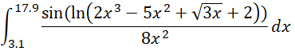

Problem Number: MME-PROB-05-05
------------------------------

Problem Title: Approximate Integral
===================================

Code filename: approximate_integral.cpp

David would like to calculate the following definite integral:

He would like your assistance writing a program to approximate the definite integral. The program should take the following general steps to calculate the integral:

1. prompt the user to input the step size for calculating the definite integral
2. start the value of x at the lower bound
3. calculate the function
4. multiply the function value by the step size and add this amount to a running total
5. increase the value of x by the step size
6. repeat steps 3. through 5. until the value of x has reached or passed the upper bound
7. the final value of the running total is the calculated value of the definite integral

Output the result to a minimum of 10 digits of precision. You will likely require functions from the < cmath > library.

### Sample Output 1

    Enter the step size for calculating the definite integral: 0.02
    -0.0062541635189908

### Sample Output 2

    Enter the step size for calculating the definite integral: 0.01
    -0.0062773262921286

### Time Target

<table>
  <tr>
    <th> Time to Complete </th>
    <th> Rating </th>
  </tr>
  <tr>
    <th> Less than 10 minutes </th>
    <th> \* \* \* </th>
  </tr>
  <tr>
    <th> 10 to 15 minutes </th>
    <th> \* \* </th>
  </tr>
  <tr>
    <th> More than 15 minutes </th>
    <th> \* </th>
  </tr>
</table>

© 2018 DAVID LAU ALL RIGHTS RESERVED
