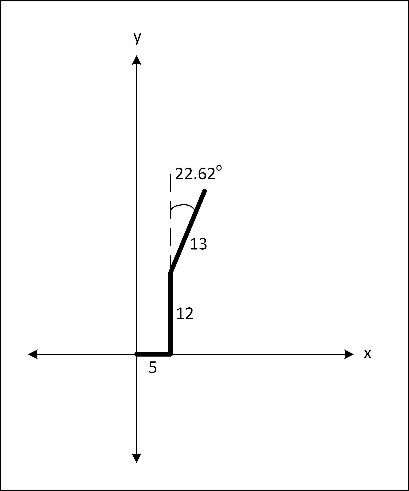

Problem Number: MME-PROB-07-03
------------------------------

Problem Title: Coordinate Tracking
==================================

Code filename: coordinate_tracking.cpp

Mike is practicing flying his drone through a series of waypoints. However, he's not quite sure where his drone is ending up. He has saved the drone directions in a file and would like you to calculate the coordinates of the drone's final location.

The input file name is "drone_directions.txt".

Each line of the file contains a distance and a heading angle (in degrees). Starting at (0,0) and facing in the direction of the positive x-axis, the drone moves according to each given direction in succession. In other words, for the first direction a heading of 0 degrees corresponds to the Cartesian vector (1, 0).

Your program is to output the Cartesian coordinates of after it has completed all the directions in the file. The output coordinates must be enclosed in round brackets and separated by a command. For example,

`(2.1, 3)`

### Sample Input

Consider the following drone_directions.txt file:

    5 0
    12 90
    13 -22.62

The following diagram shows the path taken by the drone according to these three instructions. First, it moves 5 km east, then turns 90 degrees counter-clockwise and goes 12 km, then it turn 22.62 degrees clockwise and goes 13 km. It's final coordinates are (10, 24).

### Sample Output

Your program should output the following for the sample input file above.

    (10, 24)

### Marmoset Note

Note that Marmoset will run your program multiple times, each time with a different drone_directions.txt file.

### Time Target

<table>
  <tr>
    <th> Time to Complete </th>
    <th> Rating </th>
  </tr>
  <tr>
    <th> Less than 10 minutes </th>
    <th> \* \* \* </th>
  </tr>
  <tr>
    <th> 10 to 15 minutes </th>
    <th> \* \* </th>
  </tr>
  <tr>
    <th> More than 15 minutes </th>
    <th> \* </th>
  </tr>
</table>

© 2020 DAVID LAU ALL RIGHTS RESERVED
