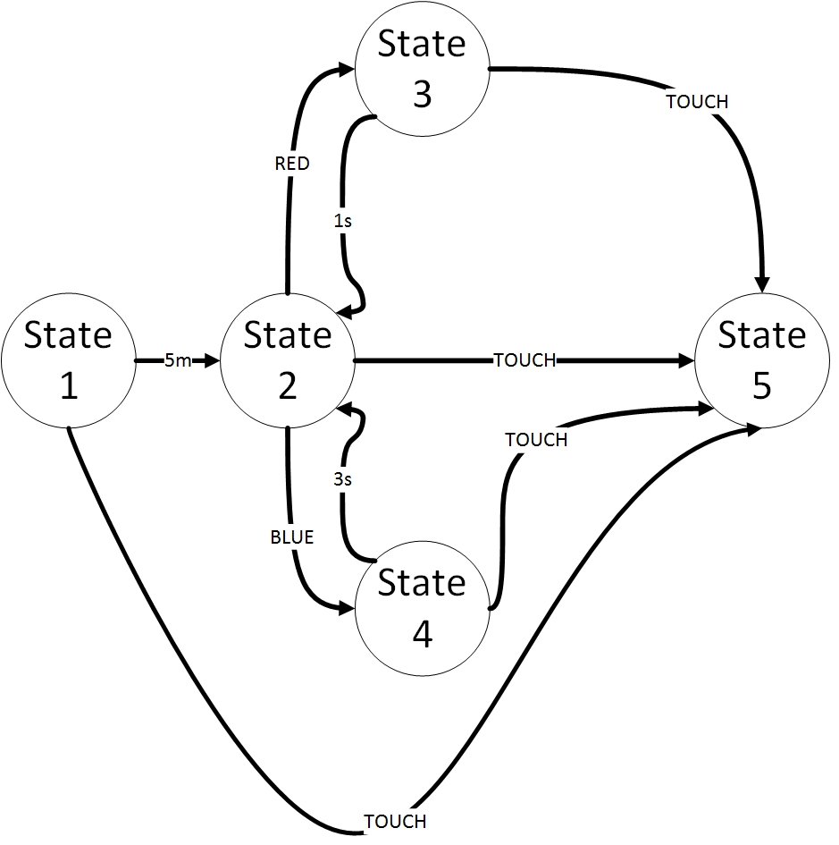
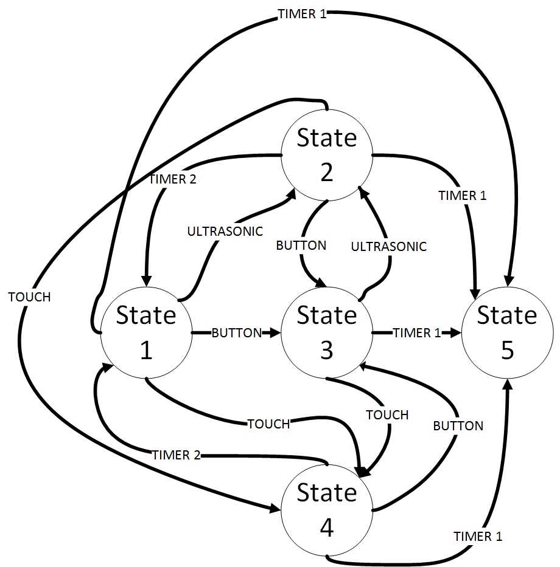

# Robot C Study Guide Solutions

Welcome to the solutions manual for the Robot C study guide.  This is a **long** document, but that's because there are many questions in the study guide.  Enjoy!

# Concepts

## The Display

### Question 1

    displayString(3,"Hello, world!");

### Question 2

    displayString(0,"Mike");
    displayString(1,"Cooper-Stachowsky");

### Question 3

The question is asking: what do you see when the following code runs:

    displayString(1,"Hi!");
    dispayString(1,"There");

In this case, the text on line 1 will be "There", not "Hi!There".  Any calls to `displayString` will delete what is already on a given line.

### Question 4

    int x = 15;
    displayString(1,"%d",x);

Notice that I had to include the format string.  The following code is **not** valid:

    displayString(1,x);

### Question 5

    int x = 10;
    float y = 12;
    displayString(1,"%d %f), x, y);

The order of the input arguments to displayString matters!  First x will be displayed, then y.

### Question 6

    int A = 5;
    int B = 7;
    displayString(1,"A = %d, B = %d", A, B);

I can mix placeholders like this inside of a string.  That's the power of displayString.

### Question 7

Here I need to use the `%.2f` option:

    float f = 1.234567;
    displayString(1,"%.2f",f);

## Initializing and reading sensors

I'll initialize all three sensors in one solution.  The sensor types shown below should be on your cheat sheet!

    sensorType[S2] = sensorSONAR;
    sensorType[S1] = sensorTOUCH;
    sensorType[S3] = sensorColorNxtFULL;

Now, let's read the sensors.

### Question 1

The data type returned by all sensors is int.  That means you can store their values as integers as well, like this:

    int x = sensorValue[S3]; //this gives me the current reading of the color
      //sensor

### Question 2

I'm going to do this in two steps.  I'm first going to store the value, then print it.  After that, I'll demonstrate how to do it all at once.

    //First way, I need an integer
    int x = sensorValue[S3];
    displayString(1,"%d",x);

    //second way: I just read it and display
    displayString(2,"%d",sensorValue[S3]);

If you run this code, you should notice that you'll see two lines with the same color value.

### Question 3

I could either memorize the color codes or use their pre-defined names.  For instance, red is `REDCOLOR`.  I'm going to use the pre-defined names, since it's far easier to remember them than the numbers themselves.

    int x = sensorValue[S3];
    if(x == BLACKCOLOR)
    {
      displayString(1,"BLACK");
    }
    else if(x == BLUECOLOR)
    {
      displayString(1,"BLUE");
    }
    else if(x == GREENCOLOR)
    {
      displayString(1,"GREEN");
    }
    else if(x == YELLOWCOLOR)
    {
      displayString(1,"YELLOw");
    }
    else if(x == REDCOLOR)
    {
      displayString(1,"RED");
    }
    else
    {
      displayString(1,"WHITE");
    }

### Question 4

The ultrasonic reads a value of 255 when there is nothing in front of it.

### Question 5

The ultrasonic's range is 2m in theory (in practice, it's difficult to detect smaller objects at this distance).  If there were an object just inside of this distance, it would read 255.  So this means that you can't tell the difference between "nothing there" and "something at 2m".  However, in practice, this is not really a problem, since it will start reading a smaller number than that if the object is anything other than 2m away but within the range, so you can detect it at, say, 199cm and get a reading of about 254.

### Question 6

This is a standard unit conversion.  We have 2m of distance broken up into 255 possible integers, so, the conversion equation is:

$$ d_{m} = \frac{2}{255}SV$$

where SV is the sensor value and $d_{m}$ is the distance, in meters.  So, to solve the question that was asked:

    float dist_m = 2.0/255.0*sensorValue[S1];
    displayString(1,"%f",dist_m);

Note: We typically don't do this conversion, and just assume that the ultrasonic is outputting a distance in centimeters.  Unless otherwise stated, that is fine for the exam.

### Question 7

The touch sensor can read 0 (not touched) or 1 (touched).

## Buttons

### Question 1

When it is not being pressed, `nNxtButtonPressed` has a value of -1.

### Question 2

`nNxtButtonPressed` can take on the values 1, 2, or 3.  

### Question 3

It cannot have the value of 0, which would be the grey button, since that will end the program.

### Question 4

The center, orange button, is button 3.  The left button is button 1, and the right button is button 2, if viewing the robot with the screen at the top.

### Question 5

This is the same as when it is not being pressed.  I asked this question twice to indicate something important - if you press a button, the value of `nNxtButtonPressed` changes **only as long as the button is being pressed down**.  It reverts back to -1 once you release it.  The robot does not "remember" which button was pressed unless you explicitly store that information.

## The motors

### Question 1

In the standard lab configuration, we have motor A and motor C in use.  motor B is not used, but the motor itself is still attached to the robot, on the bottom.  If viewing the robot from the top with the screen indicating the front of the robot, motor A is on the left, and motor C is on the right.

### Question 2

For example:

    motor[motorA] = 40;
    motor[motorC] = -34;

### Question 3

The only way to stop the motors is to set their power to 0.  The motors will continue moving with whatever power you gave them until either the program ends or you tell them to stop:

    motor[motorA] = 0;
    motor[motorC] = 0;

### Question 4

If the motors are set to different values, the robot will start to turn.  There are two main ways to turn the robot, known as "tank steering" and "car steering".  

In tank steering, the two motors are given the same power, except that one of them is given the negative, like this:

    motor[motorA] = 40;
    motor[motorC] = -40;

This will cause the robot to **turn in place** without moving forward or back.  In particular, this will cause it to rotate to the right.  To turn left, you reverse the two powers:

    motor[motorA] = -40;
    motor[motorC] = 40;

In car steering, the two motors are given different powers.  The robot will then begin to turn more slowly, like a car, and will **move in a circle**.  The circle's radius gets larger if the two powers are close to each other.  For instance:

    motor[motorA] = 40;
    motor[motorC] = 38;

This will turn in a very slow, big circle.  On the other hand:

    motor[motorA] = 40;
    motor[motorC] = -20;

This will turn in a tight circle.  Eventually, if the two get very far apart, you get back to tank steering and the robot turns in such a tight circle that it spins in place.

## Motor Encoders

### Question 1

    nMotorEncoder[motorC] = 0;

### Question 2

No.  Motor encoders can only be reset to 0.  You can't arbitrarily store a value.  In fact, if you try to change the value to anything other than 0, Robot C will just change it to 0.  More recent version of Robot C will throw an error and will not compile.

### Question 3

The encoders count upwards (towards $+\infty$) if the motor power is positive, and downwards (towards $-\infty$) if the motor power is negative.

### Question 4

We need to account for the wheel diameter.

    float dist = 2*PI*1.5*nMotorEncoder[motorA]/360.0; //this now stores the
      //distance

## Time

### Question 1

There are 4 timers on the robot, conveniently accessed through the names `T1, T2, T3` and `T4`.

### Question 2

Note: you may have never learned about `time100`.  If that's the case, don't worry too much about it. They are older ways of accessing timers, and aren't really used much anymore.  However, the answer is that they do **not** represent separate timers, just a change of units.  `time1...` measures in 1ms ticks, and `time100` measures in 100ms ticks.

### Question 3

As above, the timers themselves may never really be used in your robot.  However: if `time1[0]` is reading 3400 then 3400ms have passed since the time was last reset.  If `time100[0]` is measuring 3400, then `3400x100 = 340 seconds` have passed.

### Question 4

The best method to reset a timer is to use the `clearTimer` function like this:

    clearTimer(T1);

This resets the timer to 0.  

### Question 5

You may also choose to reset the timer directly, like this:

    time1[T1] = 0;

However, this is a bit sketchy.  In particular, you may only reset to 0, just like the encoders.   So, if you do this:

    time1[T1] = 1500;

Then Robot C will ignore it and set it to 0, and more recent versions have been throwing compiler errors if you try.  In short, **you cannot arbitrarily set a timer**.  As a result, use the  `clearTimer` function at all times if you want to reset a timer to avoid any ambiguity.

# Skills

## Button press events

### Questions 1 and 2

You are waiting on two events - one for the button press, and one for the release.

### Question 3

For the button press:

- The event will be triggered when the variable `nNxtButtonPressed` changes from -1 to any other value.
- There is nothing to be done while waiting for the event
- There is no setup required, but after the event we do need to store the value of `nNxtButtonPressed` **before** it is released.

For the button release:

- The event will be triggered when the variable `nNxtButtonPressed` changes from any value to -1.
- There is nothing to be done while waiting for the event.
- There is no setup required other than what is to be done once the button has been pressed (see above). After the event, we have to print `nNxtButtonPressed`.

### Question 4

    //first, wait for the button to be pressed
    while(nNxtButtonPressed == -1){} //do nothing while waiting
    int button = nNxtButtonPressed; //store the value before it is released
    while(nNxtButtonPressed != -1){} //do nothing while waiting

## Waiting for sensor events

### Question 1

Let's follow the design process first.  Notice, there are actually two events here: a touch sensor press and a touch sensor released.  

For the press:

- The event will be triggered when the touch sensor transitions from 0 to 1.
- There is nothing to be done while waiting
- The touch sensor must be initialized before waiting.  The action to take after the event is to start waiting for the touch sensor to be released.

For the release:

- The event will be triggered when the touch sensor transitions from 1 to 0.
- There is nothing to be done while waiting.
- There is no setup, assuming that the touch sensor was initialized for the first event above.  After the event we must set the motors to drive forward.

So, now we can write the code:

    sensorType[S1] = sensorTOUCH; // setup
    while(sensorValue[S1] == 0){} //wait, but do nothing
    while(sensorValue[S1] == 1){} //immediately start waiting for this event
    motor[motorA] = 50;
    motor[motorC] = 50; //drive forward

### Question 2

As before, we have two events to think about.  The first is to wait for the ultrasonic to read below 100. The second is to wait for it to read below 20.

Event 1:

- The event will be triggered when the ultrasonic sensor reads below 100. Note: we are assuming that the sensor initially reads above 100, but even if it doesn't, the code below will still work.
- While waiting, the robot should be moving forward.  This will be taken care of in the setup.
- For setup, we need to:
  - Make sure the sensor is initialized
  - Set the motors to run at 100% power
- After the event, we need to slow down.  This can also be considered as the setup for the second event. It's up to you.

Event 2:

This is quite similar to event 1:

- The event will be triggered when the ultrasonic sensor reads below 20
- While waiting, the robot should be moving forward.  This will be taken care of in the setup.
- For setup, we need to set the motor at 20%, since we assume that the sensors are already initialized for event 1.
- After the event, we need to stop.

The code that does this is:

    sensorType[S2] = sensorSONAR;
    motor[motorA] = 100;
    motor[motorC] = 100; //start at 100%
    while(sensorValue[S2] > 100){} //do nothing while waiting
    motor[motorA] = 20;
    motor[motorC] = 20; //you can call this setup or post-event action
    while(sensorValue[S2] > 20){} //do nothing
    motor[motorA] = 0;
    motor[motorC] = 0; //stop

## Waiting for simultaneous events

### Question 1

We have several events to keep track of.  First, if the encoder exceeds 5m, we need to start looking for colours.  Notice that I didn't specify what happens if the robot exceeds 5m driven without seeing any colour.  This is up to you.  I'm going to just let the robot keep going, and will wait only on the touch sensor.

During the entire run, the touch sensor must be polled continuously to stop the robot at any time, no matter what the encoder is reading.

After the 5m have been driven, we also look for two color sensor events.  If we see red, the robot should stop for 1s and then continue what it was doing previously.  If we see blue, we turn clockwise for 3s.

Using the idea of states, I can define the states of the robot as follows:

1 - encoder is less than 5m, touch sensor not pressed
2- encoder is greater than 5m, no color detected
3 - red is detected, touch sensor not pressed
4 - blue is detected, touch sensor not pressed
5 - touch sensor pressed

The robot begins in state 1.  The diagram below indicates how the state transitions work.  For the record, the diagram below is known as a **finite state machine**.

So let's turn this into code.

		task main()
		{
		//always initialize sensors
		SensorType[S1] = sensorTouch;
		SensorType[S2] = sensorColorNxtFULL;

		//initialize encoders
		nMotorEncoder[motorA] = 0;

		//initialize the state variable
		int state = 1;

		//we need a big while loop and a bunch of if statements
		while(state != 5)
		{
		/*
		Note: we use a bunch of if statements, rather than an if-else if-else
		structure, since it's possible to transition
		between states very quickly.  We could, for example, transition into
		state 2 and then immediately into state 3.*/
		if(state == 1 || state == 2)
		{
			motor[motorA] = 50;
			motor[motorC] = 50;
		}
		if(nMotorEncoder[motorA] * 2 * PI * 1.5/360.0 > 500 && state == 1)
		{
			state = 2;
		}
		//red is 5
		if(SensorValue[S2] == 5 && state == 2)
		{
			//not really relevant to keep track of this, you'll see why below
			state = 3;
			clearTimer(T1);
			motor[motorA] = 0;
			motor[motorC] = 0;
			while(time1[T1] < 1000 && SensorValue[S1] == 0){}
			//*always* wait on the touch sensor

			//go back to state 2, so I didn't really need to keep track of the 4
			//fact that we were in state 3
			state = 2;
		}
		//blue is color 2
		if(SensorValue[S2] == 2 && state == 2)
		{
			//Not really relevant to keep track of this, you'll see why below
			state = 4;
			clearTimer(T1);
			motor[motorA] = 40;
			motor[motorC] = -40;
			while(time1[T1] < 3000 && SensorValue[S1] == 0){}
			//*always* wait on the touch sensor

			//go back to state 2, so I didn't really need to keep track of the
			//fact that we were in state 4
			state = 2;
		}
		if(SensorValue[S1] == 1)
		{
			state = 5;
		}
		}
		//we are now in state 5
		//(otherwise we would not have exited the while loop),
		// so stop.
		motor[motorA] = 0;
		motor[motorC] = 0;
		}

## Question 2

As always, we'll begin by describing the events.

1. Ultrasonic reads < 100, move backwards for 3 seconds.
2. Touch sensor pressed, spin for 2s.
3. Orange button pressed, move forward as fast as possible
4. Timer expires (3 minutes), stop.

And let's talk about the states.

1 - Robot is stationary, no sensors/buttons pressed, timer not expired
2 - Ultrasonic has been pressed, no other sensors/buttons active, timer not expired
3 - Orange button pressed, no other sensors/buttons active, timer not expired
4 - Touch sensor pressed, no other sensors/buttons active, timer not expired
5 - Timer expires

If both the touch sensor AND the orange button are pressed, I'm going to choose to respond to each event, and allow the two events to stop each other.  As a state machine, this is:

One thing to notice is that there are a **lot** of state transitions taking place in this diagram.  We are going to use the philosophy of Question 1, above, to simplify them significantly.  The main body of code will be in a big while loop, with a bunch of if statements, **not** `if-else if-else` statements.  This allows us to simplify the logic considerably.   For example, we can see that, when in state 1, we can transition to any other state.  Also, from state 3, we can transition to most other states.  We could duplicate the decisions that need to be made, or just let the big if statement handle it.  See the code below for an example of what I mean.  In reality, this complicated state diagram can be coded quite efficiently.

You may notice that I need to use two timers for this.  The main timer is `T1`, which counts up to 3 minutes.  Then, I need another timer to count the spinning and moving backwards.

You may have also noticed that the only way to escape state 3 is for a sensor event to occur, or the main timer to run out.  In other words, it is not possible to go back to state 1 directly from state 3.

As you may imagine, the diagrams for systems with many more states can get very complicated, but state diagrams are a great way to describe what's going on.  Let's write some code.

    task main()
    {
    	//initialize sensors
    	SensorType[S1] = sensorSONAR;
    	SensorType[S2] = sensorTouch;

    	//clear timer
    	clearTimer(T1); //this is the main timer, for 3 minutes

    	//state
    	int state = 1;

    	//max time
    	const int MAX_TIME = 60*3*1000;

    	while(state != 5)
    	{
    		//as in the previous question, we want to use one
    	  //set of if statements
    		if(state == 1)
    		{
    			motor[motorA] = 0;
    			motor[motorC] = 0;
    		}
    		if(SensorValue[S1] < 100)
    		{
    			state = 2; //this won't be super relevant

    			//clear the other timer
    			clearTimer(T2);

    			//set the motors
    			motor[motorA] = -100;
    			motor[motorC] = -100;

    			//we actually need to wait on four things
    			//touch, button, T2, and T1
    			while(nNxtButtonPressed != 3 && SensorValue[S2] == 0 &&
                    time1[T1] < MAX_TIME && time1[T2] < 3000){}

    			//return to state 1 if T2 expired, otherwise let the rest of the
          //if statements
    			//handle the transition.
    			if(time1[T2] > 3000)
    				state = 1;
    		}
    		if(nNxtButtonPressed == 3)
    		{
    			//we aren't waiting on release or anything, just go
    			state = 3;

    			//set motors
    			motor[motorA] = 100;
    			motor[motorC] = 100;

    			//need to wait on three things: ultrasonic, timer, and touch
    			while(SensorValue[S1] < 100 && SensorValue[S2] == 0
             && time1[T1] < MAX_TIME){}

    			//we aren't going to transition state here, we'll let the if
          //statements below do that
    		}
    		if(SensorValue[S2] == 1)
    		{
    			state = 4;
    			//spin!
    			motor[motorA] = 100;
    			motor[motorC] = 100;

    			clearTimer(T2);

    			//we need to wait on the buton, T2, and T1
    			while(nNxtButtonPressed != 3 && time1[T1] < MAX_TIME &&
                    time1[T2] < 3000){}

    			//If T2 ran out, return to state 1
    			if(time1[T2] > 3000)
    			{
    				state = 1;
    			}

    			//Again, the if statements will handle the rest of the state
    			//transitions for us
    		}
    		if(time1[T1] > MAX_TIME)
    		{
    			state = 5;
    		}
    	}
    	//so now stop
    	motor[motorA] = 0;
    	motor[motorC] = 0;
    }

Wow!  We got through it.  If you had difficulty with this question, don't worry.  It's quite complicated.  The key thing you need to do here is work through your design first.  I like the use of states, since they tend to dramatically simplify things (eventually...).

## Keeping Track

### Question 1

The real issue with this problem is that, during turning, the encoders continue to count even though we don't want that information to be stored.  The solution is to keep a separate variable that tracks only the encoder distance that we care about. We'll need to reset the encoders after the turn.  Also, keep in mind that the encoders count backwards when the motors move backwards, but we want to compute total distance, so we'll need to account for that.

    nMotorEncoder[motorA] = 0;
    int totDist = 0;

    motor[motorA] = 40;
    motor[motorC] = 40;

    wait1Msec(5000);

    //now we store the encoder data in totDist
    totDist = nMotorEncoder[motorA];

    //turn clockwise
    motor[motorC] = -40;

    wait1Msec(1000);

    //clear the encoder
    nMotorEncoder[motorA] = 0;

    //drive backwards
    motor[motorA] = -40;

    wait1Msec(5000);

    //stop
    motor[motorA] = 0;
    motor[motorC] = 0;

    //add the negative of the encoder value, since it has been
    //counting backwards
    totDist += -nMotorEncoder[motorA];

    //convert to cm
    totDist = totDist * 1.5 * 2 * PI / 360.0;

    //display
    displayString(1,"%d",totDist);

## Question 2

This problem is a bit subtle.  When a person crosses the doorway, the ultrasonic sensor will read below 100.  **It will keep reading that value** until the person moves out of the doorway.  So we actually need to respond to two events:

1. The ultrasonic transitions from being > 100 to being < 100
2. The ultrasonic transitions **back** to > 100

We only want to count the person once, so we should do the following:

1. Keep reading the ultrasonic in a loop
2. If the ultrasonic goes below 100, increment the counter, **then wait** until it goes back up to 100 to resume doing anything else.
3. Exit when the timer expires

Notice that the timer expiry overrules the sonar sensor.  So if someone enters the doorway and doesn't leave for 20 minutes, the program should still expire.

In code:

    SensorType[S1] = sensorSONAR;
    clearTimer(T1);
    int peopleCount = 0;
    while(time1[T1] < 10*60*1000)
    {
      if(SensorValue[S2] < 100)
      {
        peopleCount++;

        //now wait on two things: the sensor to return OR the timer to
        //expire
        while(SensorValue[S2] < 100  && time1[T1] < 10*60*1000){}

        //print
        displayString(1,"%d",peopleCount);
      }
    }

## Design Patterns

### Question 1

The question is telling us three things:

1. If the robot sees white, set motor power to 100
2. If the robot sees red, set motor power to 50
3. If the robot sees blue, set motor power to 20

Interestingly, there is no stopping condition.  We don't like to use infinite loops in this class, so I'm going to introduce a new variable, nImmediateBatteryLevel.  This reads a value in mV.  The robot's battery is always above 6V, so we are going to wait on this variable to go below 2V. In effect, we've created an infinite loop.  **NOTE**: The reason I'm doing this is because the original study guide was in error, and the question didn't include an exit condition.  You don't need to know this for your exam.

    //initialize sensors
    SensorType[S2] = sensorNXTColorFULL;

    motor[motorA] = 100;
    motor[motorC] = 100;

    while(nImmediateBatteryLevel > 2000)
    {
      if(SensorValue[S2] == 5) //red
      {
        motor[MotorA] = 50;
        motor[MotorC] = 50;
      }
      else if(SensorValue[S2] == 2) //blue
      {
        motor[MotorA] = 20;
        motor[MotorC] = 20;
      }
      else if(SensorValue[S2] == 6)
      {
        //I need to reset to 100
        motor[MotorA] = 100;
        motor[MotorC] = 100;
      }
    }

### Question 2

The hard part about this problem is that the measurements of the coloured squares matter quite a bit (although the measurements of the paper and the black border are not relevant).  Once we encounter red or blue, we need to set the motor power only once.  However, it takes a bit of time to drive over the squares, so we need to wait until we've passed the square entirely before allowing the motor power to increase or decrease again.  This is similar to the problem of the person passing through the door.

I'm going to assume that the robot is driving forward at 50\% power initially, although any non-zero value will do.

    //sensors!
    SensorType[S1] = sensorNXTColorFULL;

    int power = 50;

    motor[MotorA] = power;
    motor[MotorC] = power;

    while(SensorValue[S1] != 4) //yellow
    {
      if(SensorValue[S1] == 2 && power > 30) //blue
      {
        power -= 5;
        motor[motorA] = power;
        motor[motorC] = power;

        //a do-nothing loop to get off of the blue square.
        while(SensorValue[S1] == 2){}
      }
      else if(SensorValue[S1] == 5 && power < 100) //red
      {
        power += 5;
        motor[motorA] = power;
        motor[motorC] = power;

        //a do-nothing loop to get off of the red square.
        while(SensorValue[S1] == 5){}
      }
      else if(SensorValue[S1] == 1) //black
      {
        //first, reverse, and power will do
        motor[motorA] = -50;
        motor[motorC] = -50;
        wait1Msec(500);

        //now turn, according to the rule given
        motor[motorA] = 50;
        wait1Msec(750);

        //now reset the power
        motor[motorA] = power;
        motor[motorC] = power;
      }
    }

    //we are out of the while loop, meaning we've seen yellow, so stop
    motor[motorA] = 0;
    motor[motorC] = 0;

## Applications

### Mowing the lawn

Most of what we've done above applies to help us solve this problem.  However, I'm going to use a function to make my life a bit easier.  Here are the steps I need to take:

1. Drive forward until the robot sees black.
2. At that point, I need to turn 90 degrees then move 15cm.
3. If that this point I do not see black, I turn another 90 degrees and repeat from step 1.
4. On the other hand, if I do see black, this means that I have reached the end of the lawn, and I stop.

My turns have to alternate directions.  The first time I see black I'll turn counter-clockwise, then clockwise, etc.  **Note**: I had to make a big assumption here, which is that I am at the bottom left corner of the lawn.  Since it wasn't specified in the question, this is acceptable.  

Many RobotC questions require you to make an assumption on how long it takes to turn.  Anything that is reasonable is OK.  I'm going to assume that it takes 750mS at 50% power to turn 90 degrees.

    //I'm going to use a function to turn, to make my life easier
    //It will first turn 90 degrees, then move forward.
    void turn90(int dir)
    {
      //dir == 1 means clockwise
      if(dir == 1)
      {
        motor[motorA] = 50;
        motor[motorC] = -50;
      }
      else
      {
        motor[motorA] = -50;
        motor[motorC] = 50;
      }
      wait1Msec(750);
      motor[motorA] = motor[motorC] = 0;
    }

    //next is the makeTurn function.   This one will turn 90 degrees,
    //then move forward 15cm, then decide whether to turn again or stop.
    //it returns a bool - true means keep mowing, false means we are done
    bool makeTurn(int dir)
    {
        turn90(dir);
        motor[motorA] = 50;
        motor[motorC] = 50;
        nMotorEncoder[motorA] = 0;
        //move forward
        while(nMotorEncoder[motorA] * 1.5 * 2 * PI / 360.0 < 15){}
        motor[motorA] = motor[motorC] = 0;
        //check my sensor
        if(SensorValue[S1] == 1) //black, we are done
          return false;

        //otherwise turn again and keep going
        turn90(dir);
        return true;
    }

    //with the two functions above, the task main is much simpler to write
    task main()
    {
      //sensor init
      SensorType[S1] = sensorNXTColorFULL;
      int dir = 1;
      bool keepGoing = true;
      while(keepGoing == true)
      {
        motor[motorA] = 50;
        motor[motorC] = 50;
        while(SensorValue[S1] != 1){} //wait to see black.
        keepGoing = makeTurn(dir);
        dir = -dir; //change directions
      }
    }

And that's it! Using functions made this code **a lot** simpler.  You are free to use as many functions as you feel are needed on the exam.

### Question 2

If this question looks familiar, that's because it's basically the same as the people-through-a-door problem above.  We need to:

1. Keep driving straight until the touch sensor runs into the wall.
2. Once the ultrasonic reads 255 (which we assume it will once it passes by a hole), increase the count.
3. Wait until the sensor reads less than 255 again before resuming the count.
4. All the while, if the touch sensor is pressed, stop.

    task main()
    {
      //sensor init
      SensorType[S1] = sensorSONAR;
      SensorType[S2] = sensorTouch;
      int numHoles = 0;

      while(SensorValue[S2] == 0)
      {
        if(SensorValue[S1] == 255) //we are at a hole
        {
          //increment
          numHoles++;
          //wait on two things: the SONAR to read the fence or the touch
          //sensor
          while(SensorValue[S1] == 255 && SensorValue[S2] == 0){}
        }
      }

      //all that's left is to stop and display
      motor[motorA] = 0;
      motor[motorC] = 0;
      displayString(1,"%d",numHoles);
      //and wait a bit, so we can actually see things.
      wait1Msec(2000);
    }
